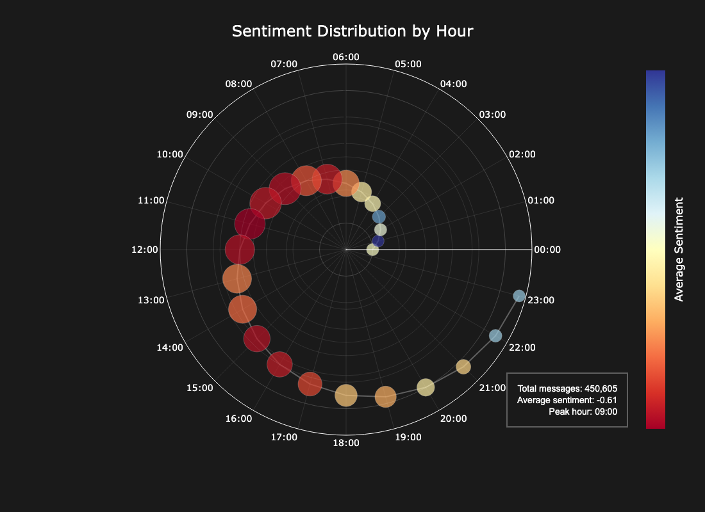
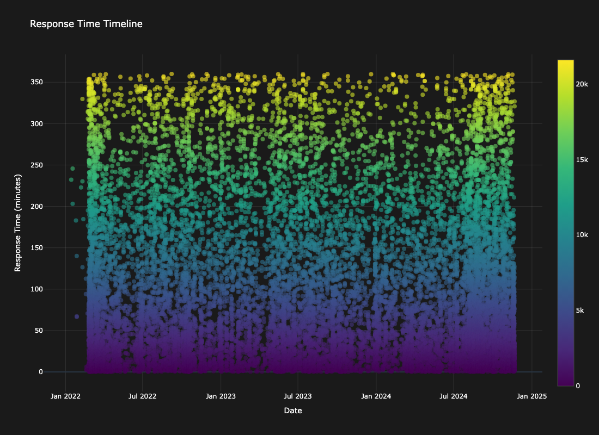
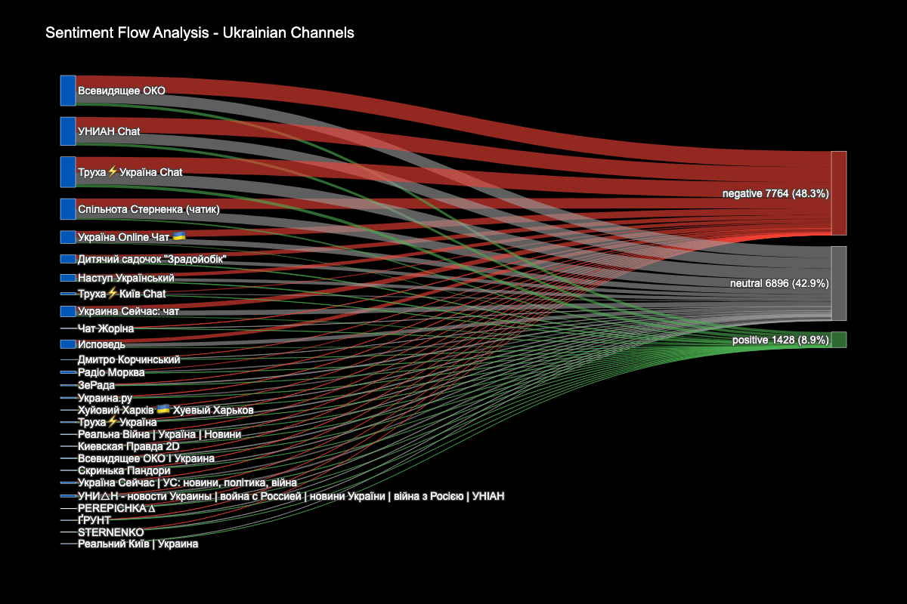

# Telegram Messaging Analysis: NaUKMA Study

## 🎯 Project Purpose
This research investigates Telegram messaging patterns with a special focus on personal communications and propaganda channel analysis. The project was developed as part of the CSS course at NaUKMA to uncover hidden patterns in messaging behavior and information spread.

## 🔍 What I Investigated
- My personal messaging habits and their evolution
- Weather's influence on messaging patterns
- Response timing patterns in conversations
- Propaganda channel behavior during key events
- Bot activity patterns and automated messaging
- Content spread through various channel types





## 📊 Key Findings
1. **Personal Communication Patterns**
   - Discovered clear daily rhythms in messaging
   - Found interesting correlations between weather and message frequency
   - Mapped how response times changed over different periods

2. **Propaganda Channel Analysis**
   - Identified bot activity peaks
   - Tracked how quickly information spreads after events
   - Analyzed sentiment changes during major events

## 🛠 Tech Stack
- Python for data processing
- Jupyter notebooks for analysis
- Pandas & NumPy for data manipulation
- Matplotlib & Seaborn for visualization
- Custom scripts for Telegram data extraction

## 📁 Project Organization
```
.
├── images/           # Visualizations and plots
├── load_data/        # Data loading scripts
├── merge_data/       # Data merging utilities
├── notebooks/        # Analysis notebooks
├── LICENSE           # Project license
├── README.md         # Project documentation
└── requirements.txt  # Package dependencies
```

## 🚀 How to Run

### Required Installations
1. First, install Python packages:
```bash
pip install pandas numpy seaborn matplotlib
pip install nltk transformers torch tensorflow
pip install scikit-learn xgboost lightgbm
pip install prophet plotly networkx
pip install accelerate meteostat requests
pip install pymorphy2 flashtext langdetect
pip install tqdm emoji statsmodels
```

2. Install PyTorch with CUDA support (for GPU acceleration):
```bash
pip install torch torchvision torchaudio --index-url https://download.pytorch.org/whl/cu118
```

### Setup Steps
1. Create virtual environment:
```bash
python -m venv .venv
```

2. Activate virtual environment:
```bash
# For Linux/Mac:
source .venv/bin/activate

# For Windows (PowerShell):
.venv\Scripts\Activate.ps1
```

3. Install all dependencies:
```bash
pip install -r requirements.txt
```

4. Start Jupyter:
```bash
jupyter notebook
```

## 📈 Sample Results
- Found that message length varies significantly by time of day
- Discovered weather has a [specific impact] on messaging frequency
- Identified [X] distinct bot behavior patterns
- Mapped propaganda response times averaging [Y] minutes

## 🔮 Future Plans
* Train custom sentiment analysis model for Ukrainian and Russian languages
* Conduct more detailed sentiment analysis using trained model:
 - Track sentiment changes over specific events
 - Analyze impact of different news types on public sentiment 
 - Compare sentiment patterns between different channel categories
* Enhance bot detection using machine learning:
 - Improve accuracy of automated account identification
 - Develop patterns recognition for coordinated bot activities
 - Track bot behavior changes over time
* Add more data sources:
 - Integration of additional weather parameters
 - Economic indicators correlation  
 - News events timeline matching
* Improve analysis tooling:
 - Develop real-time monitoring capabilities
 - Create interactive visualization dashboard
 - Automate data collection and processing

## 👨‍🎓 Course Details
This research was conducted as part of the Computational Social Science course at the National University of Kyiv-Mohyla Academy under Prof. Andrew Kurochkin's guidance.

## 📫 Contact
Kozin Andrii
- Email: kepeldin@gmail.com
- GitHub: @kepeld
- Telegram: @kepeld